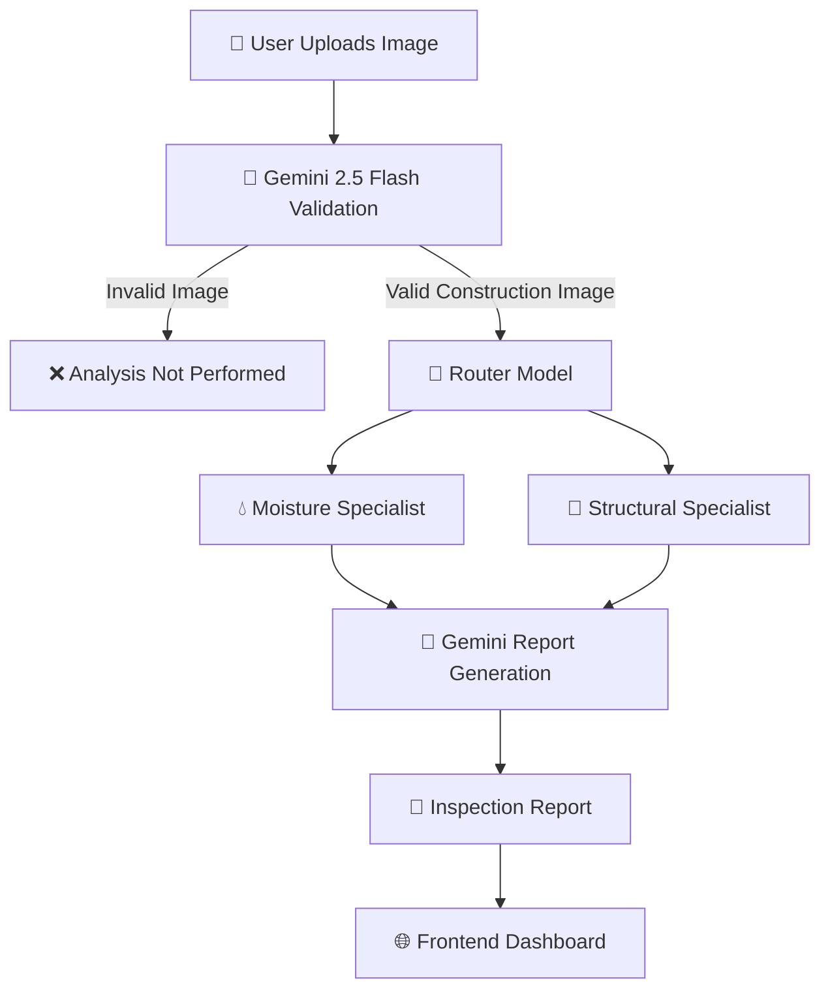
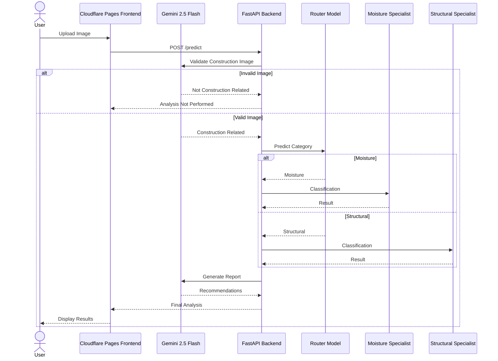

# 🏗️ ConstructGuard AI

<div align="center">

### AI-Powered Construction Defect Detection & Intelligent Inspection Platform


<br>

[](https://0cb1d45e.constructguard-ai.pages.dev/)
[](https://ayushmsingh2004-constructguard-backend.hf.space/)
[](https://ayushmsingh2004-constructguard-backend.hf.space/docs)

### 🔍 Detect • Analyze • Explain • Recommend

ConstructGuard AI leverages Deep Learning, Computer Vision, and Google Gemini 2.5 Flash to automatically identify construction defects from images and generate professional inspection reports with actionable recommendations.

</div>

---

# 🌐 Live Deployment

## 🚀 Frontend

https://0cb1d45e.constructguard-ai.pages.dev/

## ⚡ Backend API

https://ayushmsingh2004-constructguard-backend.hf.space/

## 📚 API Documentation

https://ayushmsingh2004-constructguard-backend.hf.space/docs

---

# 📖 Overview

ConstructGuard AI is an intelligent construction inspection platform designed to assist engineers, researchers, inspectors, and infrastructure professionals in identifying visible construction defects using Artificial Intelligence.

The platform combines:

* 🧠 Deep Learning Models
* 🤖 Google Gemini 2.5 Flash
* 📷 Computer Vision
* ⚡ FastAPI Backend
* 🌐 Modern React Frontend

to deliver automated defect detection and professional inspection reports.

Unlike traditional image classifiers, ConstructGuard AI first validates whether an uploaded image is genuinely related to construction or infrastructure inspection before performing any defect analysis.

---

# ✨ Key Features

* 🏗️ Construction Defect Detection
* 🤖 Gemini-Powered Image Validation
* 🧠 Multi-Model Classification Pipeline
* 📊 Severity Assessment
* 📄 AI-Generated Inspection Reports
* 🎯 Specialized Moisture & Structural Models
* 📷 Grad-CAM Visual Explanations
* 📑 PDF Report Export
* 📱 Responsive User Interface
* ☁️ Cloud Deployment

---

# 🧠 AI Inference Pipeline

## Stage 1 – Construction Image Validation

Every uploaded image is first analyzed using Google Gemini 2.5 Flash.

Gemini verifies whether the image contains:

* Buildings
* Walls
* Concrete Structures
* Infrastructure Components
* Construction Sites
* Structural Defects

If the image is unrelated to construction:

❌ Analysis Not Performed

Examples:

Valid:

* Cracks
* Buildings
* Walls
* Concrete Surfaces

Invalid:

* Humans
* Animals
* Vehicles
* Food
* Landscapes
* Random Objects

---

## Stage 2 – Router Model

After validation:

Input Image → Router Model

The Router Model predicts:

* Moisture
* Structural
* Surface
* Healthy

---

## Stage 3 – Specialist Models

### Moisture Specialist

Detects:

* Water Seepage
* Mold
* Algae
* Stains

### Structural Specialist

Detects:

* Major Crack
* Minor Crack
* Spalling
* Peeling Paint
* Healthy Surface

---

## Stage 4 – Gemini Report Generation

Gemini 2.5 Flash generates:

* Defect Explanation
* Severity Assessment
* Risk Analysis
* Repair Recommendations
* Professional Inspection Summary

---

# 🏛️ Complete System Architecture

```text
Input Image
     │
     ▼
Google Gemini 2.5 Flash
Construction Validation
     │
     ├────────► Invalid Image
     │              │
     │              ▼
     │      Analysis Not Performed
     │
     ▼
Valid Construction Image
     │
     ▼
Router Model
     │
 ┌───┴────┐
 ▼        ▼
Moisture  Structural
Model     Model
 │          │
 └────┬─────┘
      ▼
Google Gemini 2.5 Flash
Report Generation
      │
      ▼
Final Inspection Report
```

# 📂 Dataset

Dataset Repository:

https://drive.google.com/drive/folders/15lIJnX8CfX38zZy8SdtKQtN-jW_hozUF?usp=drive_link

### Categories

* Water Seepage
* Mold
* Algae
* Stains
* Major Crack
* Minor Crack
* Spalling
* Peeling Paint
* Healthy Surface

Dataset was curated for construction defect detection and structural inspection research.

---

# 🧠 Models Used

Model Repository:

https://drive.google.com/drive/folders/1SbuypC_pil5ivAY1XNpoJo8AjghUhqSw?usp=drive_link

### Router Model

```text
cg_router.keras
```

Routes images to specialist models.

### Moisture Specialist Model

```text
cg_moisture_specialist.keras
```

Classifies:

* Water Seepage
* Mold
* Algae
* Stains

### Structural Specialist Model

```text
cg_structural_specialist.keras
```

Classifies:

* Major Crack
* Minor Crack
* Spalling
* Peeling Paint
* Healthy Surface

Frameworks:

* TensorFlow
* Keras
* OpenCV
* NumPy

---

# 🛠️ Technology Stack

## Frontend

* React
* Vite
* React Router
* Framer Motion
* Recharts
* jsPDF

## Backend

* FastAPI
* TensorFlow
* Keras
* OpenCV
* Pillow
* NumPy

## AI & ML

* Google Gemini 2.5 Flash
* TensorFlow
* Computer Vision
* Grad-CAM

## Deployment

* Cloudflare Pages
* Hugging Face Spaces

---

# 🚀 Local Setup

## Clone Repository

```bash
git clone https://github.com/AYUSHMSINGH2004/ConstructGuard-AI.git
cd ConstructGuard-AI
```

## Backend

```bash
python -m venv venv
```

Windows:

```bash
venv\Scripts\activate
```

Linux/Mac:

```bash
source venv/bin/activate
```

Install dependencies:

```bash
pip install -r requirements.txt
```

Run backend:

```bash
uvicorn app:app --reload
```

## Frontend

```bash
npm install
npm run dev
```

---

# 📡 API Endpoints

## Health Check

```http
GET /health
```

## Predict

```http
POST /predict
```

Form Data:

* file
* api_key

Returns:

* Defect Prediction
* Confidence Scores
* Grad-CAM Visualization
* Gemini Report
* Recommendations

---

# 📊 Deployment Architecture



# 🔄 Sequence Diagram



# 👥 Contributors

| Contributor            | Role                                                |
| ---------------------- | --------------------------------------------------- |
| Ayush M Singh          | Project Lead, AI/ML, Backend, Frontend, Deployment  |
| Venkata Sriram Topalli | Research, Dataset Preparation, Testing & Validation |

---

# 📈 Future Enhancements

* Mobile Application
* Multi-User Support
* Cloud Report Storage
* Real-Time Monitoring
* Project Dashboard
* Advanced Analytics
* Multi-Language Support

---

# ⭐ Support

If you found this project useful:

* Star ⭐ the repository
* Fork 🍴 the project
* Share 📢 with others

---

<div align="center">

### 🏗️ Building Smarter Construction Inspections with AI

Made with ❤️ using React, FastAPI, TensorFlow and Google Gemini 2.5 Flash

</div>
