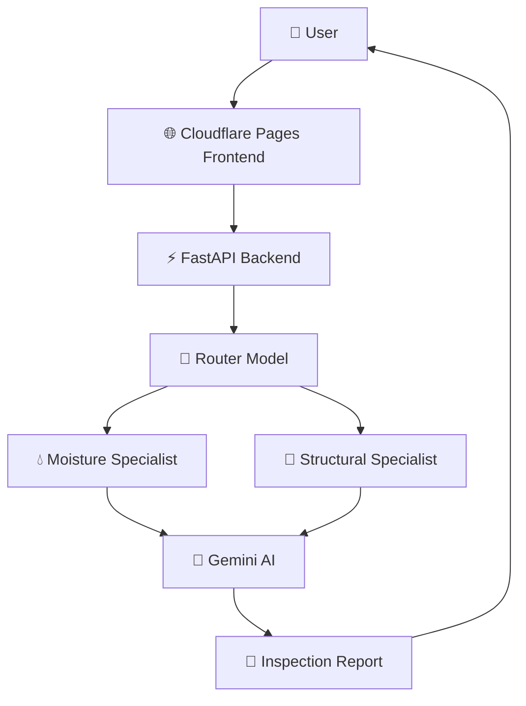
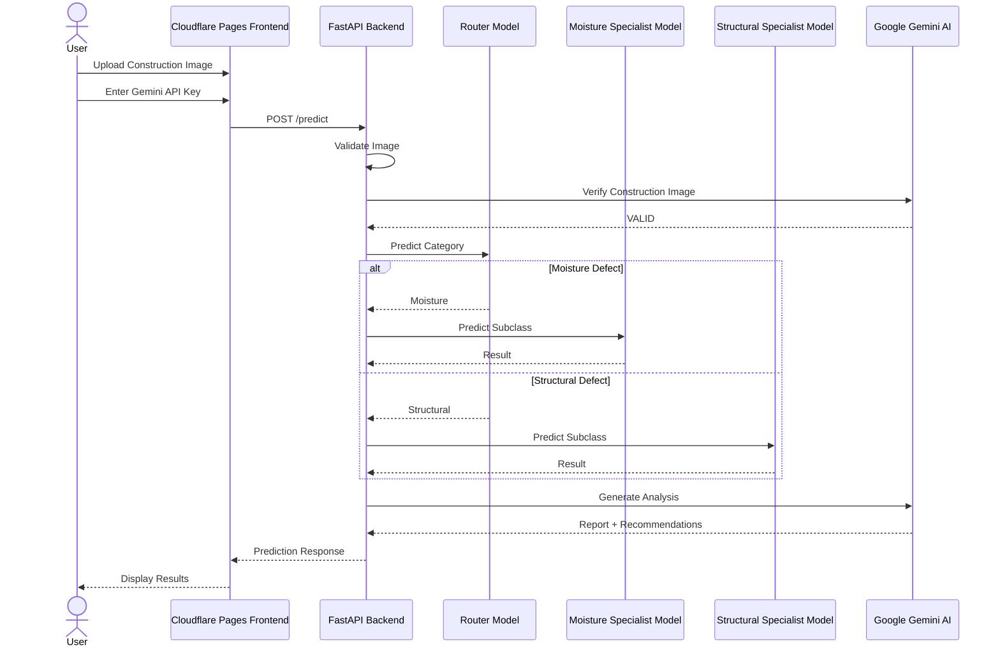

<div align="center">

# 🏗️ ConstructGuard AI

### AI-Powered Construction Defect Detection & Intelligent Inspection Platform


<br>


### 🔍 Detect • Analyze • Explain • Recommend

**ConstructGuard AI** leverages Deep Learning and Generative AI to automatically identify construction defects from images and generate professional inspection reports with actionable recommendations.

</div>

---

# 🌐 Live Deployment

### 🚀 Frontend

🔗 https://0cb1d45e.constructguard-ai.pages.dev/

### ⚡ Backend API

🔗 https://ayushmsingh2004-constructguard-backend.hf.space/

### 📚 API Documentation

🔗 https://ayushmsingh2004-constructguard-backend.hf.space/docs

---

---

# 📂 Dataset

The dataset used for training and evaluating ConstructGuard AI contains images of various construction defects and healthy building surfaces.

### Dataset Access

📁 Google Drive Dataset Repository:

https://drive.google.com/drive/folders/15lIJnX8CfX38zZy8SdtKQtN-jW_hozUF?usp=drive_link

### Dataset Categories

The dataset includes images belonging to:

- 💧 Water Seepage
- 🦠 Mold Growth
- 🌿 Algae Formation
- 🎨 Surface Stains
- 🏢 Major Cracks
- 🏢 Minor Cracks
- 🧱 Spalling
- 🎨 Peeling Paint
- ✅ Healthy Surfaces

### Dataset Purpose

The dataset was curated and organized to support:

- Construction defect detection
- Structural condition assessment
- Moisture-related damage identification
- Deep learning model training and evaluation

---

# 🧠 Trained Models

ConstructGuard AI employs a hierarchical deep learning architecture consisting of multiple TensorFlow/Keras models.

### Model Repository

📁 Google Drive Models Repository:

https://drive.google.com/drive/folders/1SbuypC_pil5ivAY1XNpoJo8AjghUhqSw?usp=drive_link

### Models Used

#### 🚦 Router Model

**File:**

```text
cg_router.keras
```

**Purpose:**

- Performs high-level defect categorization.
- Routes images to the appropriate specialist model.

---

#### 💧 Moisture Specialist Model

**File:**

```text
cg_moisture_specialist.keras
```

**Purpose:**

Classifies moisture-related defects:

- Water Seepage
- Mold
- Algae
- Stains

---

#### 🏢 Structural Specialist Model

**File:**

```text
cg_structural_specialist.keras
```

**Purpose:**

Classifies structural defects:

- Major Crack
- Minor Crack
- Spalling
- Peeling Paint
- Healthy Surface

---

### Model Architecture

The inference pipeline follows:

```text
Input Image
     │
     ▼
Router Model
     │
 ┌───┴────┐
 ▼        ▼
Moisture  Structural
Model     Model
     │
     ▼
 Gemini AI Analysis
     │
     ▼
 Final Inspection Report
```

### Framework

- TensorFlow
- Keras
- OpenCV
- NumPy

---


# 📖 Overview

ConstructGuard AI is a full-stack AI application developed to assist engineers, inspectors, researchers, and construction professionals in identifying visible construction defects from images.

The system combines:

- 🧠 Deep Learning Models
- 🤖 Google Gemini AI
- 📷 Computer Vision
- 🌐 Modern Web Technologies

to provide intelligent defect detection and detailed inspection reports.

Instead of manually inspecting images, users can simply upload a construction image and receive:

✅ Defect Classification

✅ Severity Assessment

✅ Visual Explanation

✅ AI-Generated Report

✅ Recommended Corrective Actions

---

# ✨ Key Features

## 🏗️ Construction Defect Detection

Automatically identifies:

- Major Cracks
- Minor Cracks
- Water Seepage
- Mold Growth
- Algae Formation
- Surface Stains
- Spalling
- Peeling Paint
- Healthy Structures

---

## 🧠 Multi-Model AI Pipeline

The platform uses a hierarchical AI architecture:

### 1️⃣ Router Model

Determines the broad defect category.

### 2️⃣ Specialist Models

Perform fine-grained classification.

- Moisture Specialist Model
- Structural Specialist Model

### 3️⃣ Gemini AI Analysis

Generates:

- Professional inspection summaries
- Severity explanations
- Repair recommendations
- Risk assessments

---

## 🎨 Modern User Interface

- Responsive Design
- Real-Time Analysis
- Interactive Dashboard
- PDF Report Generation
- Defect Guide
- Analysis History
- Settings Management

---

# 🏛️ System Architecture

```text
User
 │
 ▼
Cloudflare Pages Frontend
 │
 ▼
FastAPI Backend (HF Spaces)
 │
 ▼
Router Model
 ├── Moisture Specialist
 └── Structural Specialist
 │
 ▼
Gemini AI Analysis
 │
 ▼
Prediction + Recommendations
 │
 ▼
Professional Inspection Report
```

---

# 🧠 AI Pipeline

```text
Construction Image
       │
       ▼
 Image Validation
       │
       ▼
 Router Model
       │
 ┌─────┴─────┐
 ▼           ▼
Moisture   Structural
Model      Model
 │           │
 └─────┬─────┘
       ▼
 Gemini AI
       ▼
 Final Report
```

---

# 🎯 Supported Defects

| Category | Defects |
|-----------|----------|
| 💧 Moisture | Water Seepage, Mold, Algae, Stains |
| 🏢 Structural | Major Crack, Minor Crack, Spalling |
| 🎨 Surface | Peeling Paint |
| ✅ Healthy | No Significant Defect |

---

# 🛠️ Technology Stack

## Frontend

<p>

</p>

- React
- Vite
- JavaScript
- React Router
- Framer Motion
- jsPDF
- Recharts

---

## Backend

<p>

</p>

- FastAPI
- TensorFlow
- Keras
- OpenCV
- Pillow
- NumPy

---

## AI & ML

- TensorFlow/Keras
- Computer Vision
- Grad-CAM Visualization
- Google Gemini API

---

## Deployment

| Service | Platform |
|----------|----------|
| 🌐 Frontend | Cloudflare Pages |
| ⚡ Backend | Hugging Face Spaces |
| 🤖 AI Reports | Google Gemini API |

---

# 📂 Project Structure

```text
ConstructGuard-AI/
│
├── frontend_final/
│
├── app.py
├── Dockerfile
├── requirements.txt
│
├── cg_router.keras
├── cg_moisture_specialist.keras
├── cg_structural_specialist.keras
│
└── README.md
```

---

# 🚀 Local Setup

## Clone Repository

```bash
git clone https://github.com/AYUSHMSINGH2004/ConstructGuard-AI.git
cd ConstructGuard-AI
```

---

## Backend Setup

### Create Virtual Environment

```bash
python -m venv venv
```

### Activate Environment

#### Windows

```bash
venv\Scripts\activate
```

#### Linux/Mac

```bash
source venv/bin/activate
```

### Install Dependencies

```bash
pip install -r requirements.txt
```

### Run Backend

```bash
uvicorn app:app --reload
```

Backend:

```text
http://localhost:8000
```

---

## Frontend Setup

Install dependencies:

```bash
npm install
```

Run frontend:

```bash
npm run dev
```

Frontend:

```text
http://localhost:5173
```

---

# 🔐 Gemini API Integration

Users provide their own Gemini API Key.

The key is:

✅ Never stored permanently

✅ Passed securely to backend

✅ Used only during prediction

---

# 🔄 Workflow

1. Upload Construction Image
2. Validate Image
3. Router Model Prediction
4. Specialist Model Analysis
5. Gemini AI Report Generation
6. Display Results
7. Export PDF Report

---

# 📊 Deployment Architecture



---

# 🔄 Sequence Diagram



---

# 📈 Future Enhancements

- 📱 Mobile Application
- 📊 Advanced Analytics Dashboard
- 🏗️ Project Monitoring System
- 📂 Cloud Report Storage
- 👥 Multi-User Collaboration
- 🔔 Real-Time Alerts
- 🌍 Multi-Language Support

---

# 👨‍💻 Author

### Ayush M Singh

🔗 GitHub: https://github.com/AYUSHMSINGH2004

---

# ⭐ Support

If you found this project useful:

🌟 Star the repository

🍴 Fork the project

📢 Share with others

---

<div align="center">

### 🏗️ Building Smarter Construction Inspections with AI

Made with ❤️ using TensorFlow, FastAPI, React and Google Gemini

</div>
